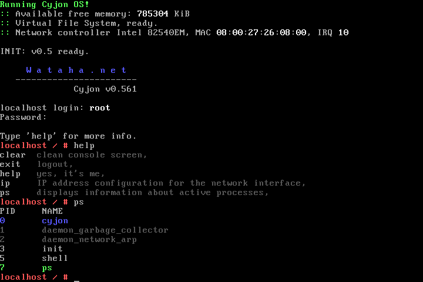

#Cyjon SU
Prosty i wielozadaniowy System Usług, napisany w języku asemblera dla procesorów z rodziny amd64/x86-64.

#Wymagania sprzętowe:
- procesor z rodziny amd64/x86-64,
- 1 MiB pamięci RAM pod adresem fizycznym 0x0000000000100000,

#Oprogramowanie:
- kompilator Nasm v2.11.08+ (http://www.nasm.us/)
- oprogramowanie Bochs v2.6.8+ (http://sourceforge.net/projects/bochs/files/bochs/),
- lub oprogramowanie Qemu v2.5.0+ (http://wiki.qemu.org/Main_Page),
- lub oprogramowanie VirtualBox v5.0.18+ (https://www.virtualbox.org/wiki/Downloads)

#Kompilacja (z poziomu konsoli):

    GNU/Linux:
    polecenie "make"

#Uruchomienie:

    W konfiguracji oprogramowania Bochs i VirtualBox ustawiamy dysk wirtualny "build/disk with omega.raw" jako IDE0 Master.

    qemu-system-x86_64 -hda "build/disk with omega.raw"

#Uwagi:
Emulatory pod systemem z rodziny MS/Windows mogą nie obsługiwać prawidłowo klawiszy strzałek/kursorów. Nie mam pojęcia kogo to wina - emulatora czy systemu.

#Credit:
Jeśli udało ci się nanieść poprawkę, ulepszenie lub coś zupełnie nowego w źródle systemu,
dopisz się do grupy programistów Wataha.net!

- Andrzej Adamczyk, akasei

#License:
Kod źródlowy systemu operacyjnego jest na licencji Creative Commons BY-NC-ND 4.0

